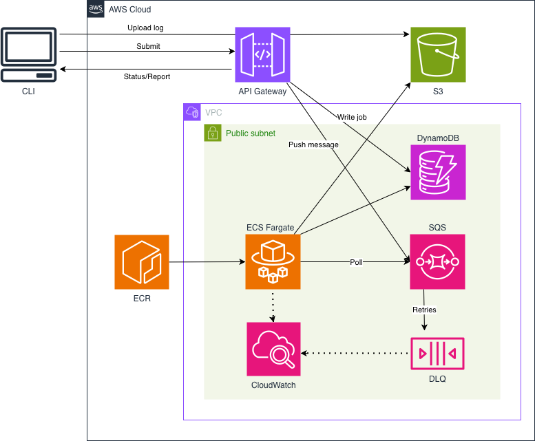

# CloudLog

**Cloud-native async log processing system**

`AWS` · `Terraform` · `Python` · `ECS Fargate` · `SQS` · `DynamoDB`

---

## Table of Contents

1. [Problem Statement](#1-problem-statement)
2. [Architecture](#2-architecture)
3. [Design Decisions](#3-design-decisions)
4. [Failure Handling](#4-failure-handling)
5. [Cost Considerations](#5-cost-considerations)
6. [How to Deploy](#6-how-to-deploy)
7. [CLI Demo](#7-cli-demo)

---

## 1. Problem Statement

Log files generated by web servers contain rich operational data such as traffic patterns, error rates, and latency distributions but processing them synchronously blocks the user and scales poorly. A 500MB log file should not require the user to wait at a terminal.

CloudLog solves this with an asynchronous processing pipeline. The user submits a log file and immediately receives a job ID. A decoupled worker picks up the job in the background, computes analytics, and stores the results. The user fetches the report whenever they want whether it be seconds, minutes, or hours later.

### Why async processing?

- Submit returns in milliseconds regardless of log file size
- The CLI, API, and worker are fully decoupled so that each can scale independently
- Worker failures are isolated and retried automatically via SQS to keep the user experience unaffected

### Why log analytics?

- Access logs follow a well-defined format (Combined Log Format), making parsing deterministic
- The metrics are meaningful and easy to demonstrate: top IPs, error rates, status distributions
- File sizes vary enough to make async processing genuinely necessary, not just theoretical

---

## 2. Architecture



### Request flow

1. CLI uploads the log file directly to S3 and calls `POST /jobs`
2. API Gateway invokes Lambda, which writes a `PENDING` job to DynamoDB and pushes a message to SQS
3. Lambda returns the `job_id` immediately so that the CLI does not wait for processing
4. ECS Fargate worker polls SQS, downloads the log from S3, computes metrics, and updates DynamoDB
5. CLI polls `GET /jobs/{id}/report` to retrieve results when ready

### Repository structure

```
cloudlog/
├── terraform/          # Infrastructure as code (IaC)
│   ├── main.tf
│   ├── variables.tf
│   ├── s3.tf
│   ├── dynamodb.tf
│   ├── sqs.tf
│   ├── vpc.tf
│   ├── iam.tf
│   ├── ecs.tf
│   └── api_gateway.tf
├── api/
│   ├── handler.py      # Lambda handler: POST /jobs, GET /jobs/{id}, GET /jobs/{id}/report
│   └── requirements.txt
├── worker/
│   ├── app.py          # SQS polling loop
│   ├── parser.py       # Combined Log Format parser
│   ├── metrics.py      # Analytics computation
│   ├── models.py       # LogEntry dataclass
│   ├── Dockerfile
│   └── requirements.txt
├── cli/
│   └── cloudlog.py     # CLI client
└── README.md
```

---

## 3. Design Decisions

| Decision | Rationale |
|---|---|
| **ECS Fargate over Lambda** | The worker is a long-running polling loop as it runs continuously and pulls work from SQS. Lambda's invocation model is event-triggered with a max runtime of 15 minutes and is the wrong fit. ECS runs the container indefinitely with no cold start overhead per message. |
| **DynamoDB over RDS** | Job records have a single access pattern: get or update by `job_id`. There are no joins, no relational queries, and no schema migrations. DynamoDB's `PAY_PER_REQUEST` billing essentially means zero cost at low traffic. |
| **SQS over direct invocation** | SQS decouples the API from the worker entirely. If the worker is down, messages queue up and are processed when it recovers. Built-in retry and DLQ fallback require no application code. |
| **Public IP over NAT Gateway** | ECS tasks are assigned public IPs rather than routing through a NAT Gateway. This avoids the $30+/month fixed cost, which is unnecessary for a portfolio environment. In production, private subnets with a NAT would be preferred for network isolation purposes. |
| **Separate ECS IAM roles** | ECS uses two IAM roles: an execution role (used by ECS to pull the Docker image from ECR and send logs to CloudWatch) and a task role (used by the worker's `boto3` calls at runtime). Combining them would over-permission the application code. |

---

## 4. Failure Handling

### Retries

SQS visibility timeout is set to 300 seconds (longer than any realistic processing time). If the worker crashes or throws an unhandled exception before deleting the message, SQS makes the message visible again after the timeout and another attempt is made. The worker only deletes the SQS message upon success.

### Dead-letter queue (DLQ)

After 3 failed receive attempts (configurable via `sqs_max_receive_count`), SQS automatically moves the message to the DLQ. A CloudWatch alarm fires when the DLQ message count exceeds zero. This is handled entirely by SQS configuration options and requires no application code.

### Idempotency

Each job has a stable `job_id` generated at submission time. DynamoDB updates use `UpdateItem` rather than `PutItem`, so re-processing the same `job_id` overwrites the record safely rather than creating a duplicate.

### Job status reporting

The worker marks jobs `PROCESSING` immediately on pickup, before any S3 download or parsing begins. On any exception it marks the job `FAILED` with the error message stored in DynamoDB. The CLI's `report` command surfaces both states explicitly so that the user always knows whether to wait or investigate.

---

## 5. Cost Considerations

Estimated monthly cost for a portfolio environment with light usage:

| Service | Notes | Est. monthly cost |
|---|---|---|
| ECS Fargate | 0.25 vCPU / 512 MB, running continuously | ~$9–11 |
| DynamoDB | PAY_PER_REQUEST, low traffic | ~$0 |
| SQS | Free tier: 1M requests/month | ~$0 |
| S3 | Minimal storage + GET/PUT requests | <$1 |
| API Gateway | $3.50 per million calls | ~$0 |
| CloudWatch Logs | 14-day retention, low volume | <$1 |
| NAT Gateway | Avoided by ECS tasks employing public IPs | $0 (saved ~$30) |

> **Production note:** In production, private subnets with a NAT Gateway would be preferred for network isolation. The $30+/month fixed cost is the primary reason this is omitted here, and is documented as a known tradeoff.

---

## 6. How to Deploy

### Prerequisites

- AWS CLI configured with appropriate credentials
- Terraform >= 1.6
- Docker with buildx (for cross-platform builds)
- Python 3.12+

### 1. Provision infrastructure

```zsh
cd terraform
terraform init
terraform apply
```

### 2. Set environment variables

```zsh
export CLOUDLOG_API_URL=$(terraform output -raw api_gateway_url)
export CLOUDLOG_S3_BUCKET=$(terraform output -raw s3_bucket_name)
export ECR_URL=$(terraform output -raw ecr_repository_url)
```

### 3. Build and push the worker image

```zsh
# Authenticate Docker to ECR
aws ecr get-login-password --region us-east-1 \
  | docker login --username AWS --password-stdin $ECR_URL

# Build for linux/amd64 (required for Fargate)
docker build --platform linux/amd64 -t cloudlog-worker ./worker
docker tag cloudlog-worker:latest $ECR_URL:latest
docker push $ECR_URL:latest

# Deploy to ECS
aws ecs update-service \
  --cluster cloudlog-cluster \
  --service cloudlog-worker \
  --force-new-deployment
```

### 4. Install CLI dependencies

```zsh
pip install boto3 requests
```

### 5. Submit a log file

```zsh
python cli/cloudlog.py submit path/to/access.log --wait
```

---

## 7. CLI Demo

### Submit a log file and wait for results

```zsh
$ python cli/cloudlog.py submit worker/sample.log --wait            
Uploading sample.log to S3...
Creating job...
Job created: 91d779f2-2bce-4d15-88bc-3196e3fab182
Waiting for job to complete  done.
Total Requests: 50
Unique IPs: 9

Top IPs:
  10.0.0.5 — 7
  192.168.1.1 — 6
  192.168.1.2 — 6
  10.0.0.8 — 6
  172.16.0.3 — 6
  192.168.1.3 — 5
  10.0.0.9 — 5
  192.168.1.4 — 5
  172.16.0.4 — 4

Status Codes:
  200 — 30
  201 — 4
  401 — 5
  500 — 3
  204 — 1
  403 — 3
  404 — 4

Error Rate: 0.30%

Total Bytes: 139257
Average Bytes / Request: 2785.14

```

### Check job status

```zsh
$ python cli/cloudlog.py status 91d779f2-2bce-4d15-88bc-3196e3fab182
Job ID: 91d779f2-2bce-4d15-88bc-3196e3fab182
Status: COMPLETED
Created: 2026-03-27T20:05:57.499137+00:00
```

### Fetch the report

```zsh
$ python cli/cloudlog.py report 91d779f2-2bce-4d15-88bc-3196e3fab182
Total Requests: 50
Unique IPs: 9

Top IPs:
  10.0.0.5 — 7
  192.168.1.1 — 6
  192.168.1.2 — 6
  10.0.0.8 — 6
  172.16.0.3 — 6
  192.168.1.3 — 5
  10.0.0.9 — 5
  192.168.1.4 — 5
  172.16.0.4 — 4

Status Codes:
  200 — 30
  201 — 4
  401 — 5
  500 — 3
  204 — 1
  403 — 3
  404 — 4

Error Rate: 0.30%

Total Bytes: 139257
Average Bytes / Request: 2785.14
```
